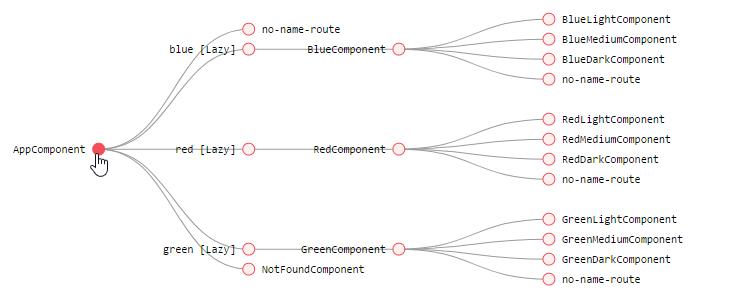

# Rutas en Angular

Proyecto generado con [Angular CLI](https://github.com/angular/angular-cli) version 1.0.0-rc.0.

Aplicación para establecer criterios sobre las rutas anidadadas.
Se utiliza:
<ul>
<li>Routing (programática y declarativa)</li> 
<li>Nested Routing</li>
<li>Lazy-loading</li>
<li>Angular Material</li> 
<li>Compodoc</li>
<li>Comunicación entre componentes</li> 
<li>Interface</li>
<li>Directivas estructurales</li>  
     <ul><li>ngIf-else</li> <li>ngFor</li> <li>ngSwitch</li></ul>
</ul> 

## Demo
Desplegada en firebase [aquí](https://colores-d5ee3.firebaseapp.com/) 

<p align="center"> 
   <span></span> 
</p> 


## Navegación entre componentes 

En esta aplicación se define un componente padre (se utiliza el app.component) y hijos (RedComponent, BlueComponent y GreenComponent. El app.component dispondrá de un router-outlet para renderizarlos. Se cargan con lazy-loading en este caso (se explica a continuación...)

```bash
  { path: 'blue', loadChildren: 'app/blue/blue.module#BlueModule' },
  { path: 'red', loadChildren: 'app/red/red.module#RedModule' },
  { path: 'green', loadChildren: 'app/green/green.module#GreenModule' }
```
Cada uno de los componentes tiene otros 3 componentes hijos (dentro de su módulo correspondiente) 
<ul>
 <li>BlueComponent:
   <ul>
     <li>BlueComponentLight</li>
     <li>BlueComponentMedium</li>
     <li>BlueComponentDark</li>
   </ul> 
 </li>
 <li>RedComponent:
   <ul>
     <li>RedComponentLight</li>
     <li>RedComponentMedium</li>
     <li>RedComponentDark</li>
   </ul> 
 </li>
  <li>GreenComponent:
   <ul>
     <li>GreenComponentLight</li>
     <li>GreenComponentMedium</li>
     <li>GreenComponentDark</li>
   </ul> 
 </li>
</ul>

Las rutas hijas de Redcomponent se definen de la siguiente forma:
```bash
  const routes: Routes = [
  {
    // Los componentes contenedores (RedComponent) necesitan tener un router-outlet para cargar sus hijos
     path: '', component: RedComponent,
     children: [
        // los componentes de las rutas hijas se renderizarán en el router-outlet definido siempre en el componente contenedor
        { path: 'light', component: RedLightComponent },
        { path: 'medium', component: RedMediumComponent },
        { path: 'dark', component: RedDarkComponent },
        // cuando pongan en el navegador pongan localhost:8080/red/ cargará el RedComponent ya que así lo mapeamos con el path '' 
        // y en su router-routlet renderizará el dark por defecto, ya que con el path '' redireccionamos a /red/dark
        { path: '', redirectTo: 'dark', pathMatch: 'full'}
     ]
  }
```

Así queda el mapa de navegación (extensión Augury)

<p align="center"> 
   <span></span> 
</p> 


## Links (routerLink)
Las rutas pueden ir precedidas de /, ../ o nada. Establece la url.

Prefijos:
<ul>
  <li>'/'	Añade la ruta a la raíz de la aplicación</li>
  <li>''	añade la ruta a partir del componente contenedor </li>
  <li>'../'	añade ruta a la url a partir del componente padre del componente contenedor </li>
</ul>

Ejemplo:
partiendo que la ruta para el componente contenedor es http://my-server/../componenteContenedor/


```bash
<a [routerLink]="['route-one']">Route One</a> -> http://my-server/../componenteContenedor/route-one
<a [routerLink]="['../route-two']">Route Two</a> -> http://my-server/../route-two
<a [routerLink]="['/route-three']">Route Three</a> ->http://my-server/route-three
```

## Lazy-Loading
Los módulos son cargados dinámicasmente. Se genera bundle (chunks) de cada uno y se cargan bajo demanda
Módulos red, blue, green cargados mediante lazy-loading ({ path: 'path', loadChildren: 'lazy-path#lazy-module' },)

```bash
  { path: 'blue', loadChildren: 'app/blue/blue.module#BlueModule' },
  { path: 'red', loadChildren: 'app/red/red.module#RedModule' },
  { path: 'green', loadChildren: 'app/green/green.module#GreenModule' }
```

 <p align="center"> 
   <span></span> 
</p> 

  En el gráfico se pueden ver los chunk, al recargar la aplicación se cargan los bundles y el '2.chunk.js' que se corresponde con el bundle para el módulo por defecto (blue.module). Al pulsar sobre 'red' se carga 0.chunk.js que se corresponde con el bundle del módulo 'red.module' y al pulsar sobre 'green' se carga el 1.chunk.js (green.module) 

## Angular Material  
Se utiliza Angular Material para las templates.

Instalar angular material
```bash
npm install --save @angular/material
```
Instalar modulo de animaciones, algún componente de AM lo utiliza en transiciones 
```bash
npm install --save @angular/animation
```

Importar módulo de material en principal y modulo de animaciones:
```bash
imports: [
    BrowserModule,
    FormsModule,
    HttpModule,
    RouterModule.forRoot(routes),
    MaterialModule.forRoot(),
    BrowserAnimationsModule
  ]
  ```
Importar en css uno de los temas del prebuilt y la material icons . Para ello en styles.css

```bash
@import '~https://fonts.googleapis.com/icon?family=Material+Icons';
@import '~@angular/material/prebuilt-themes/deeppurple-amber.css';
```

## Documentación
Ver Documentacion de la aplicación [aqui](https://colores-d5ee3.firebaseapp.com/documentation/) 

Se utiliza [compodoc](https://compodoc.github.io/website/)

### Generar documentación
Instalación global
```bash
npm install -g @compodoc/compodoc
```
Instalación local
```bash
npm install --save-dev @compodoc/compodoc
```
Definir script en package.json (se añade -a screenshots para llevar la carpeta de screenshots al generado, y el theme)
```bash
"scripts": {
  "compodoc": "./node_modules/.bin/compodoc -p tsconfig.json -a screenshots"
}
```
Lanzar script 
```bash
npm run compodoc
```
Se genera carpeta /documentation

## Deploy firebase
Se crea script en el package.json que borra /dist, genera el build para prod, documentación y despliega en firebase  

```bash
 "deploy-firebase": "del dist && ng build --env=prod --aot && npm run compodoc && move documentation dist && firebase deploy"
```